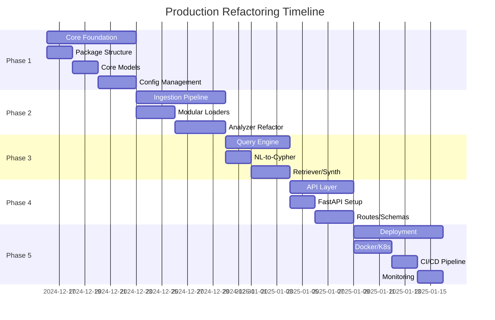

# GraphRAG Production Refactoring Roadmap

Production-Ready Architecture로의 전환을 위한 장기 상세 계획

---

## 📋 Executive Summary

| 항목 | 내용 |
|------|------|
| **목표** | Prototype → Production-Ready PropTech Platform |
| **기간** | 8주 (Sprint 기준) |
| **핵심 성과** | 모듈화, API-First, 배포 자동화, 모니터링 |
| **리스크** | LLM 의존성, 레거시 호환성, 테스트 커버리지 |

---

## 🎯 Phase Overview



---

## 📁 Target Repository Structure

```
src/realestaterag/
├── core/               # Domain models, interfaces
├── ingestion/          # Data ingestion pipeline
├── graph/              # GraphRAG module (기존 v3.0 통합)
├── query/              # Query engine
├── api/                # FastAPI REST API
├── services/           # Business logic
├── infrastructure/     # DB, LLM, Storage clients
├── utils/              # Utilities
└── config/             # Settings

deployments/
├── docker/             # Docker configs
├── kubernetes/         # K8s manifests
└── terraform/          # IaC (optional)

tests/
├── unit/
├── integration/
└── e2e/
```

---

## 🗓️ Week-by-Week Implementation Plan

### Week 1: Core Foundation

#### Day 1-2: Package Structure
**Goal:** 설치 가능한 Python 패키지 구조 생성

| Task | Output | Owner |
|------|--------|-------|
| `src/realestaterag/` 디렉토리 생성 | 패키지 구조 | Dev |
| `pyproject.toml` 설정 | 빌드 설정 | Dev |
| `__init__.py` 파일 생성 | 모듈 설정 | Dev |
| 기존 코드 이동 | 마이그레이션 | Dev |

**Deliverables:**
```bash
# 패키지 설치 가능
pip install -e .

# Import 정상 작동
from realestaterag.core import models
```

#### Day 3-4: Core Models
**Goal:** Pydantic 기반 도메인 모델 정의

**Files to Create:**
- `core/models.py` - 핵심 데이터 모델
- `core/enums.py` - 열거형 정의
- `core/exceptions.py` - 커스텀 예외
- `core/interfaces.py` - 추상 인터페이스

**Key Models:**
```python
# 기존 v3.0 모델 통합 + 확장
- Report
- District
- PropertyComplex
- Infra
- MarketSnapshot
- AnalysisResult
```

#### Day 5-7: Configuration Management
**Goal:** 환경별 설정 관리 시스템

**Implementation:**
```python
# Pydantic Settings 기반
from pydantic_settings import BaseSettings

class Settings(BaseSettings):
    environment: str = "development"
    llm_api_url: str
    falkordb_url: str
    ...
```

**Deliverables:**
- `.env.example` 템플릿
- `config/settings.py`
- `config/logging.yaml`

---

### Week 2: Ingestion Pipeline Refactoring

#### Day 1-3: Modular Loaders
**Goal:** 데이터 로딩 모듈화

**Components:**
| Module | Responsibility |
|--------|---------------|
| `multimodal_loader.py` | 이미지 + 텍스트 로딩 |
| `document_parser.py` | PDF/PPTX 파싱 |
| `storage_interface.py` | 스토리지 추상화 |

**Migration:**
```
기존: analysis/data_loader.py
    ↓
신규: ingestion/loaders/multimodal_loader.py
```

#### Day 4-7: Analyzer Refactoring
**Goal:** 분석 파이프라인 분리

**신규 구조:**
```
ingestion/analyzers/
├── __init__.py
├── qwen_analyzer.py      # 기존 qwen_analyzer.py 마이그레이션
├── fact_extractor.py     # Stage 1: 팩트 추출
├── visual_verifier.py    # Stage 2: 시각적 검증
└── sentiment_analyzer.py # Stage 3: 감성 분석
```

**Key Changes:**
- `QwenAnalyzer` → 단일 책임으로 분리
- 의존성 주입 패턴 적용
- 비동기 처리 지원

---

### Week 3: Query Engine Refactoring

#### Day 1-2: NL-to-Cypher Module
**Goal:** 자연어 → Cypher 변환 분리

**Components:**
```python
# query/nl_to_cypher.py
class NLToCypherTranslator:
    async def translate(self, question: str) -> List[str]:
        ...
```

**기존 v3.0 통합:**
- `CYPHER_GENERATION_PROMPT_V3` 마이그레이션
- `_match_preset_query_v3()` 통합

#### Day 3-5: Retriever & Synthesizer
**Goal:** 검색 및 응답 생성 분리

**신규 구조:**
```
query/
├── engine.py          # 오케스트레이터
├── nl_to_cypher.py    # NL→Cypher
├── retriever.py       # 그래프 검색
├── synthesizer.py     # 응답 생성
└── cache.py           # 쿼리 캐싱
```

**Cache Layer:**
```python
# Redis 기반 쿼리 캐싱
class QueryCache:
    async def get(self, question: str) -> Optional[Dict]
    async def set(self, question: str, result: Dict, ttl: int = 3600)
```

---

### Week 4: API Layer

#### Day 1-2: FastAPI Setup
**Goal:** REST API 기본 구조

**Files:**
- `api/main.py` - FastAPI 앱
- `api/dependencies.py` - DI 설정
- `api/middleware.py` - 미들웨어

**Features:**
- CORS 설정
- 에러 핸들링
- Request/Response 로깅
- Rate limiting

#### Day 3-5: Routes & Schemas
**Goal:** API 엔드포인트 구현

**Endpoints:**
| Method | Path | Description |
|--------|------|-------------|
| GET | `/health` | 헬스체크 |
| POST | `/api/v1/query` | 자연어 쿼리 |
| POST | `/api/v1/ingestion` | 리포트 적재 |
| GET | `/api/v1/reports/{id}` | 리포트 조회 |
| GET | `/api/v1/complexes` | 단지 목록 |

**Request/Response Models:**
```python
# api/v1/schemas/query.py
class QueryRequest(BaseModel):
    question: str
    use_cache: bool = True

class QueryResponse(BaseModel):
    answer: str
    sources: List[str]
    confidence: float
    cypher: str
```

---

### Week 5-6: Deployment Infrastructure

#### Week 5, Day 1-3: Docker Configuration
**Goal:** 컨테이너화 및 오케스트레이션

**Dockerfiles:**
| File | Purpose |
|------|---------|
| `Dockerfile.api` | API 서비스 |
| `Dockerfile.worker` | 백그라운드 워커 |
| `docker-compose.yml` | 로컬 개발 환경 |

**Services:**
```yaml
services:
  - falkordb      # 그래프 DB
  - vllm          # LLM 서버
  - api           # FastAPI
  - streamlit     # UI
  - prometheus    # 메트릭
  - grafana       # 대시보드
```

#### Week 5, Day 4-5: Kubernetes Config
**Goal:** K8s 배포 준비

**Structure:**
```
kubernetes/
├── base/                 # 기본 매니페스트
│   ├── deployment.yaml
│   ├── service.yaml
│   └── configmap.yaml
└── overlays/
    ├── dev/
    ├── staging/
    └── production/
```

#### Week 6: CI/CD & Monitoring

**GitHub Actions:**
```yaml
# .github/workflows/ci.yml
- lint: ruff, mypy
- test: pytest
- build: docker
- deploy: staging → production
```

**Monitoring Stack:**
- Prometheus: 메트릭 수집
- Grafana: 대시보드
- OpenTelemetry: 분산 추적
- Loguru: 구조화된 로깅

---

### Week 7: Testing & Quality Assurance

#### Test Coverage Goals
| Type | Coverage | Priority |
|------|----------|----------|
| Unit | 80% | High |
| Integration | 60% | Medium |
| E2E | 40% | Medium |

#### Test Structure
```
tests/
├── unit/
│   ├── test_models.py
│   ├── test_analyzers.py
│   └── test_graph_schema.py
├── integration/
│   ├── test_ingestion.py
│   └── test_query_engine.py
└── e2e/
    └── test_api_workflow.py
```

---

### Week 8: Migration & Rollout

#### Migration Steps
1. **Staging 배포** (Day 1-2)
   - 신규 구조 배포
   - 기존 데이터 마이그레이션
   - 통합 테스트

2. **Canary 배포** (Day 3-4)
   - 10% 트래픽 분배
   - 메트릭 모니터링
   - Rollback 준비

3. **전체 롤아웃** (Day 5-7)
   - 100% 트래픽 전환
   - 레거시 시스템 종료
   - 문서화 완료

---

## ⚠️ Risk Mitigation

### High Priority Risks

| Risk | Impact | Mitigation |
|------|--------|------------|
| LLM 서버 다운타임 | 전체 서비스 중단 | 폴백 모드, 캐싱 |
| 마이그레이션 데이터 손실 | 데이터 무결성 | 백업, 검증 스크립트 |
| API 성능 저하 | 사용자 경험 | 로드 테스트, 캐싱 |

### Rollback Plan
```bash
# 즉시 롤백 (5분 이내)
kubectl rollout undo deployment/realestaterag-api

# 데이터 롤백 (필요시)
pg_restore -d realestaterag backup_YYYYMMDD.sql
```

---

## 📊 Success Metrics

### Technical Metrics
| Metric | Current | Target |
|--------|---------|--------|
| API Latency (p95) | N/A | < 500ms |
| Query Accuracy | 70% | 85% |
| Test Coverage | 10% | 80% |
| Deployment Time | Manual | < 10min |

### Business Metrics
| Metric | Target |
|--------|--------|
| 일일 쿼리 처리량 | 10,000+ |
| 동시 사용자 | 100+ |
| 시스템 가용성 | 99.5% |

---

## 🔧 Technology Stack

### Current → Target

| Component | Current | Target |
|-----------|---------|--------|
| **Framework** | 스크립트 기반 | FastAPI + Uvicorn |
| **Database** | FalkorDB | FalkorDB (변경 없음) |
| **LLM** | vLLM/llama.cpp | vLLM (표준화) |
| **UI** | Streamlit | Streamlit → React (Phase 2) |
| **Container** | Docker | Docker + K8s |
| **CI/CD** | Manual | GitHub Actions |
| **Monitoring** | None | Prometheus + Grafana |

---

## 📝 Migration Checklist

### Phase 1 Completion
- [ ] 패키지 구조 생성
- [ ] Core models 정의
- [ ] Settings 구현
- [ ] Unit tests 작성

### Phase 2 Completion
- [ ] Loaders 모듈화
- [ ] Analyzers 분리
- [ ] 비동기 처리

### Phase 3 Completion
- [ ] Query engine 분리
- [ ] Cache layer 구현
- [ ] v3.0 통합

### Phase 4 Completion
- [ ] FastAPI 앱
- [ ] API endpoints
- [ ] OpenAPI docs

### Phase 5 Completion
- [ ] Docker images
- [ ] K8s manifests
- [ ] CI/CD pipeline
- [ ] Monitoring

---

## 📚 Documentation Deliverables

| Document | Path | Status |
|----------|------|--------|
| Architecture Guide | `docs/architecture/` | Planned |
| API Reference | `docs/api/openapi.yaml` | Planned |
| Deployment Guide | `docs/guides/deployment.md` | Planned |
| Development Guide | `docs/guides/development.md` | Planned |

---

## 👥 Team Responsibilities

| Role | Responsibilities |
|------|-----------------|
| **Backend Dev** | Core, Ingestion, Query Engine |
| **DevOps** | Docker, K8s, CI/CD |
| **QA** | Testing, Quality |
| **Product** | Requirements, Acceptance |

---

## 🚀 Quick Start (Post-Refactoring)

```bash
# Development
git clone https://github.com/daisybum/realEstateRAG.git
cd realEstateRAG
uv venv && source .venv/bin/activate
uv pip install -e ".[dev]"
make dev

# Production
docker-compose -f deployments/docker/docker-compose.yml up -d
# or
kubectl apply -k deployments/kubernetes/overlays/production/
```

---

**Created:** 2024-12-11  
**Version:** 1.0.0  
**Status:** Planning Phase
