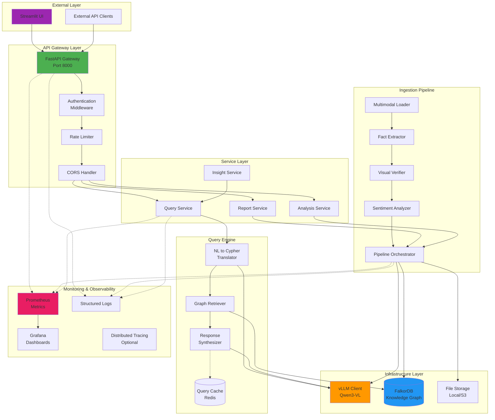

# System Architecture

RealEstateRAG 시스템 아키텍처 다이어그램

---

## System Overview



---

## Data Flow

```mermaid
graph LR
    subgraph "Ingestion Flow"
        A[Real Estate Report<br/>PDF + Images] --> B[Multimodal Loader]
        B --> C{Data Type}
        C -->|Text| D[Text Extraction]
        C -->|Images| E[Image Processing]
        D --> F[Qwen3-VL Analysis]
        E --> F
        
        F --> G[Fact Extraction]
        G --> H[Visual Verification]
        H --> I[Sentiment Analysis]
        I --> J[Insight Generation]
        
        J --> K[JSON Result]
        K --> L[Graph Transformer]
        L --> M[(FalkorDB<br/>Knowledge Graph)]
    end
    
    subgraph "Query Flow"
        Q1[User Question:<br/>"전세가율 60% 이상<br/>저평가 단지는?"] --> Q2[NL Understanding]
        Q2 --> Q3{Cache Hit?}
        Q3 -->|Yes| Q4[Return Cached]
        Q3 -->|No| Q5[NL to Cypher<br/>Translation]
        
        Q5 --> Q6[Generate Cypher:<br/>MATCH Complex-Grade<br/>WHERE grade='undervalued'<br/>AND ratio > 0.6]
        Q6 --> Q7[Execute Query<br/>on FalkorDB]
        Q7 --> Q8[Graph Results]
        
        Q8 --> Q9[Context Assembly]
        Q9 --> Q10[LLM Synthesis]
        Q10 --> Q11[Natural Language<br/>Response + Sources]
        Q11 --> Q12[Cache Result]
        Q12 --> Q13[Return to User]
    end
    
    M -.->|Read| Q7
    
    style A fill:#FFF3E0
    style K fill:#E8F5E9
    style M fill:#E3F2FD
    style Q1 fill:#FCE4EC
    style Q11 fill:#E8F5E9
    style Q3 fill:#FFF9C4
```

---

## Component Description

### External Layer
- **Streamlit UI**: 데모용 웹 인터페이스
- **API Clients**: 외부 시스템 연동

### API Gateway Layer
- **FastAPI**: REST API 엔드포인트 (Port 8000)
- **Middleware**: 인증, Rate Limiting, CORS

### Service Layer
- **Report Service**: 리포트 관리
- **Analysis Service**: 분석 오케스트레이션
- **Query Service**: 자연어 쿼리 처리

### Infrastructure Layer
- **vLLM Client**: Qwen3-VL 모델 API
- **FalkorDB**: Knowledge Graph 저장소
- **File Storage**: 리포트 파일 저장 (Local/S3)
